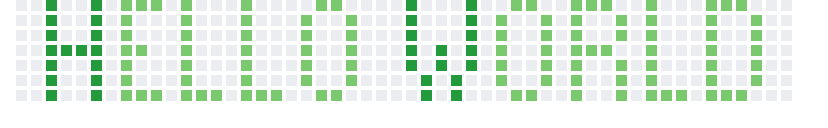

<p></p>

&nbsp;&nbsp;&nbsp;&nbsp;&nbsp;&nbsp;&nbsp;&nbsp;&nbsp;&nbsp;&nbsp;&nbsp;&nbsp;&nbsp;&nbsp;&nbsp;&nbsp;&nbsp;&nbsp;&nbsp;&nbsp;&nbsp;&nbsp;&nbsp;&nbsp;&nbsp;&nbsp;&nbsp;&nbsp;[](https://open.spotify.com/user/marcos_barker) [](https://open.spotify.com/user/marcos_barker) 

<a href="https://linktr.ee/marcos_barker">

</a>

</br>
</br>

[](https://github.com/marcosbarker/marcosbarker/actions/workflows/waka-readme.yml)

<!--START_SECTION:waka-->


**I'm a Night 🦉** 

```text
🌞 Morning    7 commits      █░░░░░░░░░░░░░░░░░░░░░░░░   7.0% 
🌆 Daytime    34 commits     ████████░░░░░░░░░░░░░░░░░   34.0% 
🌃 Evening    31 commits     ███████░░░░░░░░░░░░░░░░░░   31.0% 
🌙 Night      28 commits     ███████░░░░░░░░░░░░░░░░░░   28.0%

```
📅 **I'm Most Productive on Friday** 

```text
Monday       6 commits      █░░░░░░░░░░░░░░░░░░░░░░░░   6.0% 
Tuesday      25 commits     ██████░░░░░░░░░░░░░░░░░░░   25.0% 
Wednesday    12 commits     ███░░░░░░░░░░░░░░░░░░░░░░   12.0% 
Thursday     4 commits      █░░░░░░░░░░░░░░░░░░░░░░░░   4.0% 
Friday       43 commits     ██████████░░░░░░░░░░░░░░░   43.0% 
Saturday     5 commits      █░░░░░░░░░░░░░░░░░░░░░░░░   5.0% 
Sunday       5 commits      █░░░░░░░░░░░░░░░░░░░░░░░░   5.0%

```


📊 **This Week I Spent My Time On** 

```text
⌚︎ Time Zone: America/Sao_Paulo

🔥 Editors: 
Eclipse                  7 hrs 36 mins       ██████████████░░░░░░░░░░░   58.46% 
VS Code                  4 hrs 29 mins       ████████░░░░░░░░░░░░░░░░░   34.52% 
Notepad++                54 mins             █░░░░░░░░░░░░░░░░░░░░░░░░   7.03%

💻 Operating System: 
Windows                  13 hrs              █████████████████████████   100.0%

```


<!--END_SECTION:waka-->


<a href="https://github.com/marcosbarker/alura.imersaoDev">
  
</a>  
<a href="https://github.com/marcosbarker/alura.imersaoDados">  
  
</a>
<a href="https://github.com/marcosbarker/serratec.residencia">
  
</a>
<a href="https://github.com/marcosbarker/NLW4-rocketpay">  
  
</a>
<a href="https://github.com/marcosbarker/recreating.instagram.homepage">  
  
</a>
<a href="https://github.com/marcosbarker/netflix-simple-copy">  
  
</a>