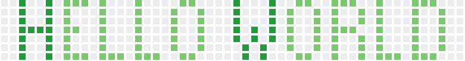

 

<!--

 

&nbsp;&nbsp;&nbsp;&nbsp;&nbsp;&nbsp;&nbsp;&nbsp;&nbsp;&nbsp;&nbsp;&nbsp;&nbsp;&nbsp;&nbsp;&nbsp;&nbsp;&nbsp;&nbsp;&nbsp;&nbsp;&nbsp;&nbsp;&nbsp;&nbsp;&nbsp;&nbsp;&nbsp;&nbsp;&nbsp;&nbsp;&nbsp;&nbsp;&nbsp;&nbsp;
-->

  

    <a href="https://coinmarketcap.com/">
      <h1>My cRyPtOs</h1>
    </a>
  

    
    
    
    
    
 <!--
    
-->
    
    
    
    
    
    
    
    

 

  <a href="https://open.spotify.com/user/marcos_barker">
   
  

 
<!-- -->
<!--&nbsp;&nbsp;&nbsp;&nbsp;&nbsp;&nbsp;&nbsp;&nbsp;&nbsp;&nbsp;&nbsp;&nbsp;&nbsp;&nbsp;&nbsp;&nbsp;&nbsp;&nbsp;&nbsp;-->

  

&nbsp;&nbsp;&nbsp;&nbsp;&nbsp;&nbsp;&nbsp;&nbsp;&nbsp;&nbsp;&nbsp;&nbsp;&nbsp;&nbsp;&nbsp;&nbsp;&nbsp;&nbsp;&nbsp;&nbsp;&nbsp;&nbsp;&nbsp;&nbsp;&nbsp;&nbsp;&nbsp;&nbsp;&nbsp;&nbsp;&nbsp;&nbsp;&nbsp;&nbsp;&nbsp;&nbsp;&nbsp;&nbsp;&nbsp;&nbsp;&nbsp;&nbsp;&nbsp;&nbsp;&nbsp;&nbsp;&nbsp;&nbsp;&nbsp;&nbsp;&nbsp;&nbsp;&nbsp;&nbsp;&nbsp;&nbsp;&nbsp;&nbsp;&nbsp;&nbsp;&nbsp;&nbsp;&nbsp;&nbsp;&nbsp;&nbsp;&nbsp;&nbsp;     
&nbsp;&nbsp;&nbsp;&nbsp;&nbsp;&nbsp;&nbsp;&nbsp;&nbsp;&nbsp;&nbsp;&nbsp;&nbsp;&nbsp;&nbsp;&nbsp;&nbsp;   

   

<!--servidores-stats-->
<!--https://readme-stats-marcosbarker.vercel.app/-->
<!--https://github-readme-stats.vercel.app/-->

  &nbsp;&nbsp;&nbsp;&nbsp;&nbsp;&nbsp;&nbsp;&nbsp;&nbsp;&nbsp;&nbsp;&nbsp;&nbsp;&nbsp;&nbsp;&nbsp;&nbsp;&nbsp;&nbsp;&nbsp;&nbsp;&nbsp;&nbsp;&nbsp;&nbsp;&nbsp;&nbsp;&nbsp;&nbsp;

  

 

<!--

-->
<!--START_SECTION:waka-->

 Last Updated on 22/08/2022 01:43:57 UTC
<!--END_SECTION:waka-->
<!--INICIO GRAFICO-->

<!--FIM GRAFICO-->
<!--INICIO PINS STIYLE-->
  

  

  

<!--FIM PINS STIYLE-->
<!--
#c64dff
#3AFC55
#52fa5a
#ffc64d
#3B93E6
#4dfcff
#ffffff
#9e4c98
#00e658
#df82f2
#000000
-->
<!--INICIO AREA TESTE
* # EM TESTE 🧪🧪🧪🧪
Spotify Recently Played README Generator 
Markdown code snippet:

For custom count (1 ≤ {count} ≤ 10):

For custom width (300 ≤ {width} ≤ 1000):

FIM AREA TESTE-->
